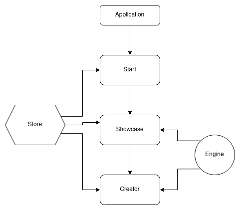

> This document will describe the general architecture of the application and serves as a starting point for development.

## A tale of two brothers.

### For the moment, there are two main parts: the user interface and the rendering engine ( and the backend, maybe in the future).

The user interface includes all the components that the user can see. Every page has its own React component. E.g.: `/#/showcase/` -> `Showcase.tsx`. The building blocks for these components are in `assets` and `components` on the `src` folder. For passing data through components, we use a state manager similar to React's hooks - see the `store` folder.

The star of this application is the rendering engine. The engine has two main jobs: to generate the final logo in SVG format and to export the result in other formats like png, webp, jpeg with different sizes based on their platform of use (Facebook, Twitter). Unlike the user interface, the engine does not use React, and it is framework agnostic - you can use it with other frameworks like Vue, Svelte, or pure HTML & Javascript. The main folder is in the `engine` on the `src` folder.

## Overview

The application has two separate build pipelines: the WordPress block and the LogoMaker app. The LogoMaker can run separately from WordPress; all you need to this to make sure that `logo-maker.js` is on the page and has a root parent ("#themeisle-logo-maker-root").

If you want to extend the WordPress plugin, you work in `./wordpress` using webpack with the command `npm run start-plugin`. For developing LogoMaker, you have `./src` and the command `npm run start` for running without WordPress using SnowPack.

The LogoMaker has three main pages: start, showcase, and creator - every page has a React component with the same name. In the `./src` folder are four subfolders: `assets` ( for SCSS files, SVG images, and fonts ), `components` ( for creating the main components of the page ), `stores` ( definitions for the state management service ), and the `engine` ( functions for rendering the final logos ).

### How can the WordPress plugin communicate with LogoMaker?

One simple word: `PHP`. [Example](https://github.com/Soare-Robert-Daniel/logo-maker/blob/e509f673383d8754a80765dc06968616b4d29715/index.php#L77-L82). You have to use PHP for sending data to the LogoMaker. The simple solution is to dump the data in the global scope in the window object. **You need to declare the data type of the dumped data so that Typescript can recognize it, like [this](https://github.com/Soare-Robert-Daniel/logo-maker/blob/e509f673383d8754a80765dc06968616b4d29715/types/static.d.ts#L73-L91).**

## Engine

The jewelry of this project is the engine for rendering the final logo. The user interface is just a simple CRUD application, but the engine is more than that. Developing the engine is not an easy task; you need to make sure that code is not too cumbersome, research math formulas for calculating the position of the shapes, keep a clean architecture, etc.

**For the math part, I recommend looking at some basics linear algebra on youtube. It is enough for this stage of the project.**

### Code flow and arhitecture

Developers who can keep a clean and maintainable code architecture are worth their weight in gold. At the moment of the writing of this paragraph, the LogoMaker has 50 logos and three options for alignment. Since it is not significant, the general structure of code use function composition and higher-order function - named 'the great pipeline.'. The general flow of the code act as a pipeline: data comes from the store -> create the essential shapes -> create the extra shapes -> align the shapes -> move, resize, rescale -> return the SVG -> export the SVG to formats like PNG, WEBP, JPEG in a zip file.

The great pipeline has two main parts: the render pipelines and the exporter.

The render pipeline has the job of producing the SVGs that are going to the exporter. They are in the `\engine\pipeline.ts` and formed from builders and aligners. The types provided by TypeScript dictate the order of the functions - to use an aligner, you need to give the necessary shapesm, and so on. At this moment, there are two render pipelines: the one that produces the final logo named `createEditor` and one specialized for favicon named `createFavicon`

The exporter has the job of producing images that are going to be downloaded by the user after finishing the logo's design. The developer must be aware of creating images from SVG in Javascript in different browsers ( the most notable being Safari ).

### Extending

In the future, the LogoMaker might be problematic with multiple alignment options, shapes, settings, etc. There are different paradigms for dealing with the code's structure; you might opt for a functional or an OOP paradigm. **In any of these cases, you must be aware of the [cargo cult](https://en.wikipedia.org/wiki/Cargo_cult_programming).** Take time to plan and sketch the new structure of 'the great pipeline'.
